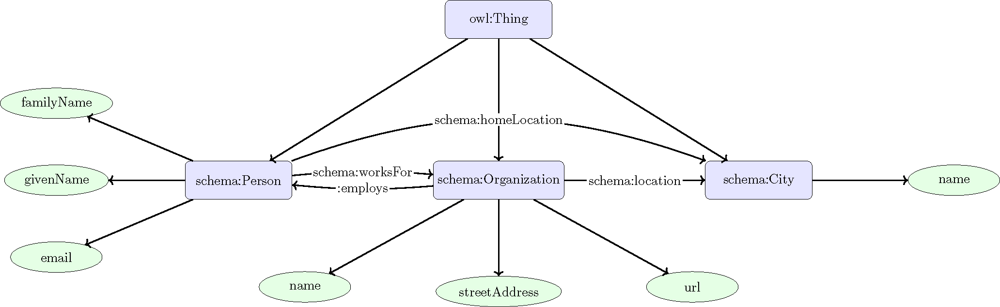

## Ontology Example

This section presents a simple example of an ontology mapping individuals, organizations, and cities.

### The Ontology

This ontology provides a semantically structured representation of persons, organizations, and cities. It is developed using OWL 2 and reuses vocabulary from http://schema.org to ensure interoperability and alignment with widely adopted web standards. The ontology models three primary classes:

- `schema:Person`: Represents an individual, capturing attributes such as `schema:givenName`, `schema:familyName`, `schema:homeLocation`, and `schema:email`.
- `schema:Organization`: Represents a business, school, or institution, and captures attributes such as the organization name `schema:name`, street address `schema:streetAddress`, and website URL `schema:url`.
- `schema:City`: Represents a city or town.

The classes are defined in OWL using Turtle syntax as:

```turtle
<http://schema.org/City> rdf:type owl:Class .
<http://schema.org/Organization> rdf:type owl:Class .
<http://schema.org/Person> rdf:type owl:Class .
```

The data properties are defined as:

```turtle
<http://schema.org/email> rdf:type owl:DatatypeProperty ;
    rdfs:domain <http://schema.org/Person> ;
    rdfs:range xsd:string .

<http://schema.org/familyName> rdf:type owl:DatatypeProperty ;
    rdfs:domain <http://schema.org/Person> ;
    rdfs:range xsd:string .

<http://schema.org/givenName> rdf:type owl:DatatypeProperty ;
    rdfs:domain <http://schema.org/Person> ;
    rdfs:range xsd:string .

<http://schema.org/name> rdf:type owl:DatatypeProperty ;
    rdfs:domain [
        rdf:type owl:Class ;
        owl:unionOf (
            <http://schema.org/City>
            <http://schema.org/Organization>
        )
    ] ;
    rdfs:range xsd:string .

<http://schema.org/streetAddress> rdf:type owl:DatatypeProperty ;
    rdfs:domain <http://schema.org/Organization> ;
    rdfs:range xsd:string .

<http://schema.org/url> rdf:type owl:DatatypeProperty ;
    rdfs:domain <http://schema.org/Organization> ;
    rdfs:range xsd:anyURI .
```

**Note**: Observe that the `schema:name` data property is defined to have a domain that is the union of `schema:City` and `schema:Organization`. This means that any individual using the `schema:name` property must be an instance of at least one of these two classes—`schema:City`, `schema:Organization`, or both.

These classes are semantically linked using the following object properties:

- `schema:worksFor`: Links a `schema:Person` to their employer, a `schema:Organization`.
- `:employs`: Custom inverse property of `schema:worksFor`.
- `schema:location`: Links a `schema:Organization` to a `schema:City`.
- `schema:homeLocation`: Links a `schema:Person` to a `schema:City`.

These object properties are defined in Turtle syntax as:

```turtle
<http://schema.org/homeLocation> rdf:type owl:ObjectProperty ;
    rdfs:domain <http://schema.org/Person> ;
    rdfs:range <http://schema.org/City> .

<http://schema.org/location> rdf:type owl:ObjectProperty ;
    rdfs:domain <http://schema.org/Organization> ;
    rdfs:range <http://schema.org/City> .

<http://schema.org/worksFor> rdf:type owl:ObjectProperty ;
    rdfs:domain <http://schema.org/Person> ;
    rdfs:range <http://schema.org/Organization> .

:employs rdf:type owl:ObjectProperty ;
    rdfs:domain schema:Organization ;
    rdfs:range schema:Person ;
    owl:inverseOf schema:worksFor .
```

Reusing standardized vocabulary from [Schema.org](http://schema.org) promotes both human and machine readability, and facilitates interoperability with other ontologies and data schema. The onology is illustrated below.



### Instiation the ontology
The ontology includes a set of individuals that instantiate the defined classes to represent real-world entities. Two persons, Axel Eklund and Stina Eklund, are modeled as instances of `schema:Person`, each associated with a `schema:givenName`, `schema:familyName`, and `schema:emailAddress`. The organization Aboa Mare is defined as an instance of `schema:Organization`, with associated attributes such as `schema:name`, `schema:streetAddress`, and `schema:url`. Additionally, the city Turku is modeled as an instance of `schema:City`, identified by its `schema:name`. These individuals are further connected through object properties indicating place of residence, organizational affiliation, and geographic location.


The individuals are defined in Turtle syntax as:
```turtle
:AxelEklund rdf:type schema:Person ;
    schema:givenName "Axel" ;
    schema:familyName "Eklund" ;
    schema:email "axel.eklund@example.com" .

:StinaEklund rdf:type schema:Person ;
    schema:givenName "Stina" ;
    schema:familyName "Eklund" ;
    schema:email "stina.eklund@example.com" .

:AboaMare rdf:type schema:Organization ;
    schema:name "Aboa Mare" ;
    schema:streetAddress "Juhana Herttuan puistokatu 21, 20100 Turku, Finland" ;
    schema:url <http://www.aboamare.fi> .

:Turku rdf:type schema:City ;
    schema:name "Turku" .
```

The ontology includes object property assertions that link individuals through properties `schema:worksFor`, `schema:location`, and `schema:homeLocation`. These assertions capture relationships such as employment and place of residence. The implementation in Turtle syntax looks like:

```turtle
:AxelEklund schema:worksFor :AboaMare .
:StinaEklund schema:worksFor :AboaMare .
:AboaMare schema:location :Turku .
:AxelEklund schema:homeLocation :Turku .
:StinaEklund schema:homeLocation :Turku .
```

### Inference using a reasoner
When a reasoner is applied to this ontology, it can automatically infer additional facts based on the declared axioms. For instance, since `:employs` is defined as the inverse of `schema:worksFor`, the reasoner will infer that `:AboaMare` `:employs` both `:AxelEklund` and `:StinaEklund`, even though these relationships were not explicitly asserted. This enhances semantic completeness and supports more expressive querying and knowledge discovery. The following RDF triples were inferred by the reasoner:

```turtle
:AboaMare :employs :AxelEklund .
:AboaMare :employs :StinaEklund .
```
